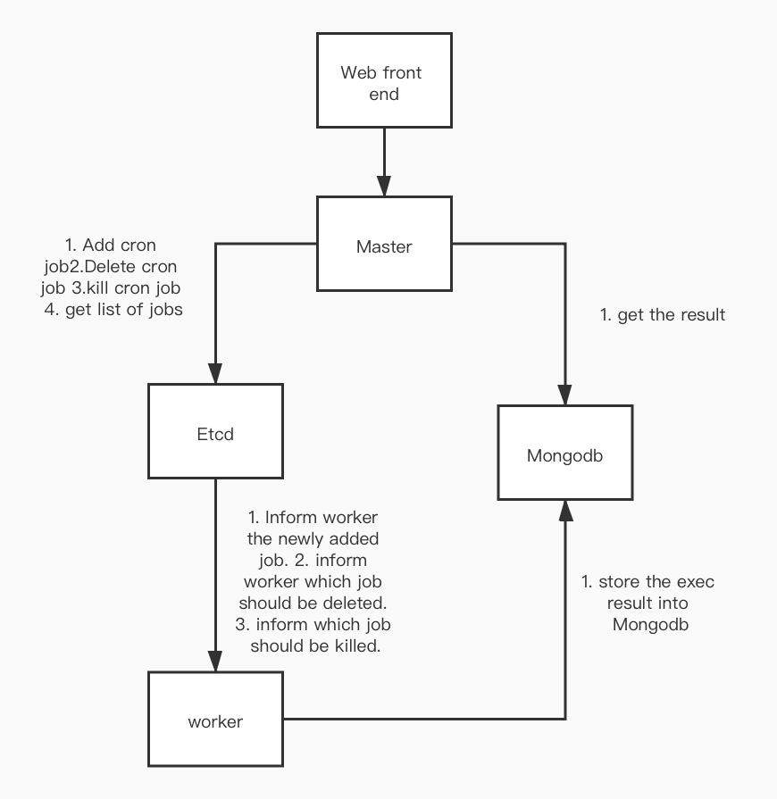
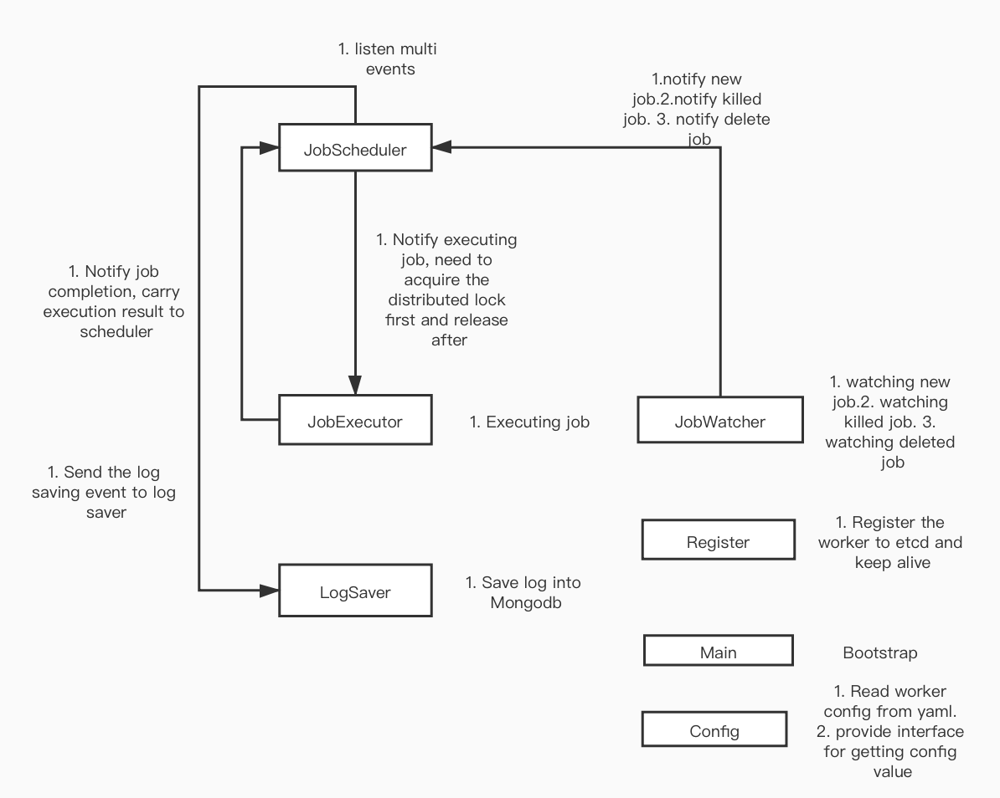

# Design Documentation 

## 1. What is CronCord?
 
In most of the enterprise environments, great numbers of cron jobs need to be run on the backend
machines. In a traditional way, most of the developers will access one box and execute shell script
together with crontab, which is a popular tool on Linux platform. The drawback of doing so is obvious
for several reasons. Most of them are listed below:

* There is no easy to pinpoint the machine on which the cron job is running. Developers need to manually
do the book keeping, which is error-prone and inefficient. 
* There is no easy way to tell the execution result. Developers need to manually get access to the machine
in order to see the result, which is cumbersome. 
* Killing and deleting a job requires developers to manually get access to machine so they can perform
the action.
* Canceling the job will put the developers in the same situation as the above one. 

As an attempt to make developers' life easier and also make sure developers can automate this process in 
a distributed environment. This article proposes a design of CronCord, a framework that enables creating,
scheduling, and executing cron job in a distributed environment.

## 2. What should CronCord do?(Requirements)

### 2.1 Allow developers creating cron job, specifically:

* GUI allows creating name for cron job 
* GUI allows Configuring cron expression for cron job
* GUI allows inputting Bash Shell script(A textbox might suffice for simple shell command, however, it 
is not uncommon to see lengthy shell scripting that it makes sense to save them in files and upload through GUI)

### 2.2 Allow developers deleting existing cron jobs

### 2.3 Allow developers killing running cron jobs

### 2.4 Show the execution result of cron jobs 

### 2.5 Show machine list and its status(up or down)

### 2.6 Show job list

## 3. Architecture

On a high level, the system adopts a master-worker architecture which is a classic route for building distributed
system. The system will contain a front-end displaying the GUI that the end user can perform action via. 

### 3.1 Principle architecture components

* `GUI web front end` provides end user interface to use the system

* `Master` directly serves the web front end and interact with data source

* `Metadata store` a distributed data store job information and worker node information, also serves as the service discovery centor

* `Worker` contains multiple worker nodes that do all the execution and planning. 

* `Log store` a distributed data store to store job execution logs

### 3.2 Architecture Diagram

### 3.3 Implementation Module Diagram

